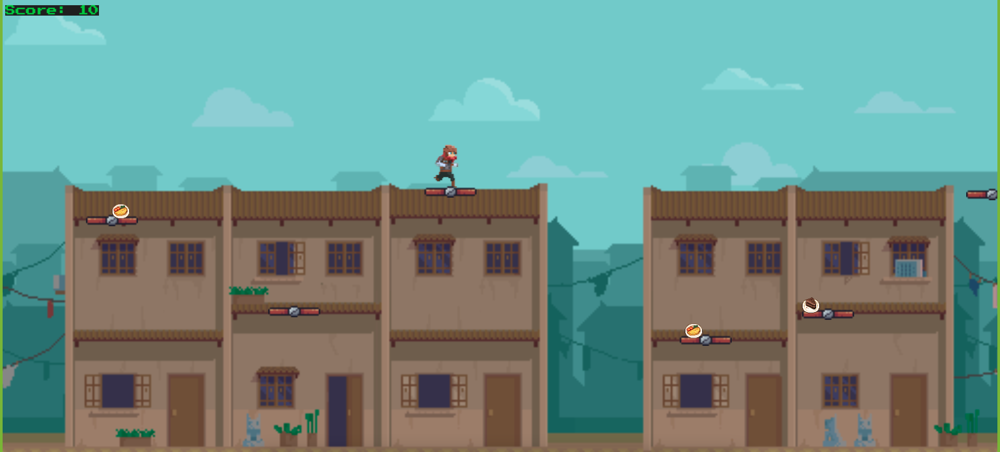

# TEAM 05-Group Project 2: Interactive Full-Stack Application

# Food run

## Table of Contents

1. [Description](#description)
2. [Resources](#resources)
3. [Visuals](#visuals)
4. [Author and Aknowledgement](#author-and-aknowledgements)

## User Story

AS someone who grew up playing 2d games,
I WANT to be able to play a game that will also teach people to eat healthy,
I WANT play a new game that i've never played before,
SO THAT i can experience a whole new 2d game 

## Description

This gets the user to sign in with their own account to play an enjoyable game

## Resources

* [Live Site](https://pacific-everglades-44013.herokuapp.com/)

* [Repository](https://github.com/untjala/food-run)

## Visuals

## Authors and Acknowledgements

code created & optimized by UNCC Coding Bootcamp Students - Connor Thompson, Marquise Allen, Charles Young, Patrick Long, and Jala Unterreiner